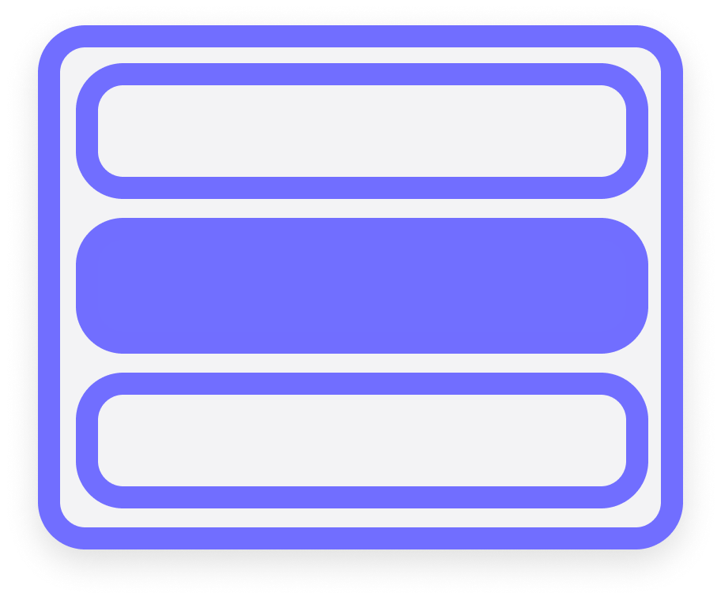

<!-- [![Contributors][contributors-shield]][contributors-url] -->
<!-- [![Forks][forks-shield]][forks-url] -->
<!-- [![Stargazers][stars-shield]][stars-url] -->
[![Issues][issues-shield]][issues-url]
[![MIT License][license-shield]][license-url]
[Twitter][twitter-shield]


<!-- PROJECT LOGO -->
<br />
<p align="center">
  <a href="#">
    
  </a>

  <h2 align="center">Vue Context</h2>

  <p align="center">
    A simple context-menu for your vue projects!
    <br />
    <a href="https://github.com/othneildrew/Best-README-Template"><strong>Explore the docs »</strong></a>
    <br />
    <br />
    <a href="https://github.com/othneildrew/Best-README-Template">View Demo</a>
    ·
    <a href="https://github.com/othneildrew/Best-README-Template/issues">Report Bug</a>
    ·
    <a href="https://github.com/othneildrew/Best-README-Template/issues">Request Feature</a>
  </p>
</p>


<!-- TABLE OF CONTENTS -->
## Table of Contents

* [About the Project](#about-the-project)
  * [Built With](#built-with)
* [Getting Started](#getting-started)
  * [Prerequisites](#prerequisites)
  * [Installation](#installation)
* [Usage](#usage)
* [Roadmap](#roadmap)
* [Contributing](#contributing)
* [License](#license)
* [Contact](#contact)
* [Acknowledgements](#acknowledgements)


<!-- ABOUT THE PROJECT -->
## About The Project

[![Product Name Screen Shot][product-screenshot]](https://example.com)

Simple, custom context menu for Vue.js. allows multiple options deep and handles both left and right clicks. Extends vue-simple-context-menu.

Here's why to use it: 
* Easy setup, just include the vue component into your project. 
* Completely customisable, you can pass through custom classes, symbols and more! 
* Create sub-menus to your hearts content! (Try keep it accessible.)

A list of commonly used resources that I find helpful are listed in the acknowledgements.

### Built With
Frameworks, Modules & Tools
* [Vue](https://vuejs.org/)
* [V Click Outside](https://www.npmjs.com/package/v-click-outside)


<!-- GETTING STARTED -->
## Getting Started

To get checkout a local copy of the examples follow these steps.

### Prerequisites

This is an example of how to list things you need to use the software and how to install them.
* npm
```sh
npm install -g npm@latest
```
* vue
```sh
npm install -g @vue/cli
# OR
yarn global add @vue/cli
```

### Installation

1. Clone the repo
```sh
git clone https://github.com/ogriffithjones/vue-contextmenu
```
2. Install NPM packages
```sh
cd vue-contextmenu && npm install
```
3. Run the example
```sh
cd examples && npm run watch
```


<!-- USAGE EXAMPLES -->
## Usage

Require component in Vue
```JS
import VueContext from 'vue-contextmenu'
Vue.component('vue-context', VueContext)
```

Examples In Progress......

_For more examples, please refer to the [Documentation](https://example.com)_


<!-- ROADMAP -->
## Roadmap

See the [open issues](https://github.com/ogriffithjones/vue-contextmenu/issues) to propose a features (and report issues).


<!-- CONTRIBUTING -->
## Contributing

👍 Any contributions you make are **greatly appreciated**.

1. Fork the Project
2. Create your Feature Branch (`git checkout -b feature/AmazingFeature`)
3. Commit your Changes (`git commit -m 'Add some AmazingFeature'`)
4. Push to the Branch (`git push origin feature/AmazingFeature`)
5. Open a Pull Request


<!-- LICENSE -->
## License

Distributed under the MIT License. See `LICENSE` for more information.


<!-- CONTACT -->
## Contact
Oliver Griffith-Jones - [@olzgj](https://twitter.com/olzgj) - hello@olivergriffithjones.com

Project Link: [github.com/ogriffithjones/vue-contextmenu/](https://github.com/ogriffithjones/vue-contextmenu/)


<!-- ACKNOWLEDGEMENTS -->
## Acknowledgements
* [Vue Simple Context Menu](https://github.com/johndatserakis/vue-simple-context-menu)
* [V Click Outside](https://www.npmjs.com/package/v-click-outside)


<!-- MARKDOWN LINKS & IMAGES -->
<!-- https://www.markdownguide.org/basic-syntax/#reference-style-links -->
[contributors-shield]: https://img.shields.io/github/contributors/othneildrew/Best-README-Template.svg?style=flat-square
[contributors-url]: https://github.com/othneildrew/Best-README-Template/graphs/contributors
[forks-shield]: https://img.shields.io/github/forks/othneildrew/Best-README-Template.svg?style=flat-square
[forks-url]: https://github.com/othneildrew/Best-README-Template/network/members
[stars-shield]: https://img.shields.io/github/stars/othneildrew/Best-README-Template.svg?style=flat-square
[stars-url]: https://github.com/othneildrew/Best-README-Template/stargazers
[issues-shield]: https://img.shields.io/github/issues/othneildrew/Best-README-Template.svg?style=flat-square
[issues-url]: https://github.com/othneildrew/Best-README-Template/issues
[license-shield]: https://img.shields.io/github/license/othneildrew/Best-README-Template.svg?style=flat-square
[license-url]: https://github.com/othneildrew/Best-README-Template/blob/master/LICENSE.txt
[twitter-shield]: https://img.shields.io/twitter/follow/OlzGJ?label=Follow
[product-screenshot]: images/screenshot.png
